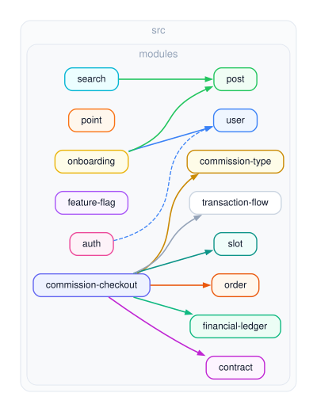
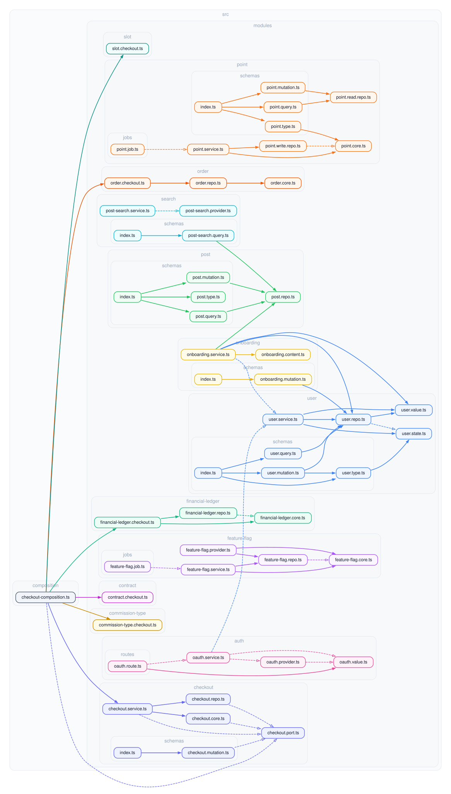

# `src/modules`

Each feature module owns one vertical slice of the domain: its Prisma access
(`*.repo.ts`), its pure core (`*.core.ts` / value + state files), its service
use-cases (`*.service.ts`), and its delivery layer — GraphQL `schemas/`, HTTP
`routes/` (as in `auth`), and/or scheduled Agenda `jobs/` (as in `point`,
`feature-flag` and `ledger`). The per-module blueprint and the layer rules
live in [CONVENTIONS.md](../../CONVENTIONS.md); this file is about how the modules
depend on **each other**.

## Module dependency graph



Every arrow above is a sanctioned cross-module dependency — and there are no
others. The edges form a DAG by construction (`user` and `post` never point
back), so a module-level import cycle can only appear by editing the allowlist
in [`.dependency-cruiser.mjs`](../../.dependency-cruiser.mjs), which is the
review point. This is the whole allowlist (CONVENTIONS §5, "module services
depend one way only"):

| Edge | Why | Kind |
| --- | --- | --- |
| `onboarding → user`, `onboarding → post` | the cross-module use-case composes both modules' repo functions inside one transaction | value |
| `search → post` | search hydrates external-index hits (ids) through the post repo | value |
| `auth → user` | auth provisions / looks up a user, but the user service is **injected** (wired in `createServices`); importing values would bypass that seam, so this edge is `import type` only | type-only |

`user`, `post`, `point`, `feature-flag`, and `ledger` import no other module.
The open arrowhead on `auth → user` marks the type-only edge (erased at
compile time); solid arrowheads are runtime value imports.

`ledger` is a leaf by design, not merely by accident of being new. It names no
domain: an order, a gift and a payout all reach it as a reference id plus a set
of operations, and the currency rules enter it as injected policy data. An edge
from `ledger` to a module that spends money would invert that, and the laws in
`ledger.core.ts` hold globally only because nothing above it can reach around
them.

### Why `point` and `ledger` both exist

They own **different rows** and neither is authoritative over the other's, so
§11's ownership question has a straight answer: `point` owns `PointCharge`,
`PointSpend` and `PointBalance`; `ledger` owns the `Ledger*` tables. Nothing
reads or writes across that line, which is why both can be registered at once
without a cross-module edge.

They are here for different reasons, and a reader should take different things
from each. `point` is the SMALL worked blueprint — the shortest complete
example of the layer split and the plan pattern, and the one to copy when
adding an ordinary module. `ledger` is the same pattern under real pressure: a
money model with a supply boundary, escrow, lot identity, exchange rates and
eight numbered laws. It is deliberately larger than any module a reference
repository needs, because the point of it is what the pattern looks like when
the domain stops being simple.

A production system would pick one. Migrating `point`'s rows onto the ledger is
the obvious next change, and it is a separate one: it touches `point`'s public
mutations, so landing it with the ledger itself would put two independent
decisions in one diff. Until then the word "ledger" carries an older, narrower
sense inside `point/` — `PointLedgerInconsistencyError` and the `arbLedger`
generator mean that module's own list of charges, not this module.

## Changing this graph

Where a change lives — extending a module, creating a new one, or adding an
edge above — is decided by the four-question procedure in
[CONVENTIONS §11](../../CONVENTIONS.md#11-module-boundaries--extend-create-or-take-an-edge).
In short: rows an existing module owns → extend that module; a new noun with
its own invariants → a new leaf **owner** module (the default-deny rule means
this needs no allowlist edit); a use-case composing several owners, or an
external port/protocol over one → a new **composite** module above them,
which takes the edges. Before any edge, walk the coupling ladder (declared
read composition → data as parameters → injected service → allowlisted value
import) and take the weakest rung that works.

A new edge enters only through a PR that extends the allowlist in
`.dependency-cruiser.mjs`, adds a row to the table above (and keeps it a
DAG), and regenerates both SVGs in this file — the PR template's edge-audit
checklist walks through it.

<details>
<summary>File-level dependency graph (every file under <code>src/modules</code>)</summary>



</details>

## Regenerating

Both images are checked-in SVGs produced by
[dependency-cruiser](https://github.com/sverweij/dependency-cruiser) and
[Graphviz](https://graphviz.org/) (`dot` must be on `PATH`):

```sh
pnpm graph:modules
```

The overview collapses each `src/modules/<name>/` folder to a single node; the
detail graph keeps every file. The graph **shape** — no runtime cycles and the
cross-module allowlist above — is enforced in CI by `pnpm check:graph`.
